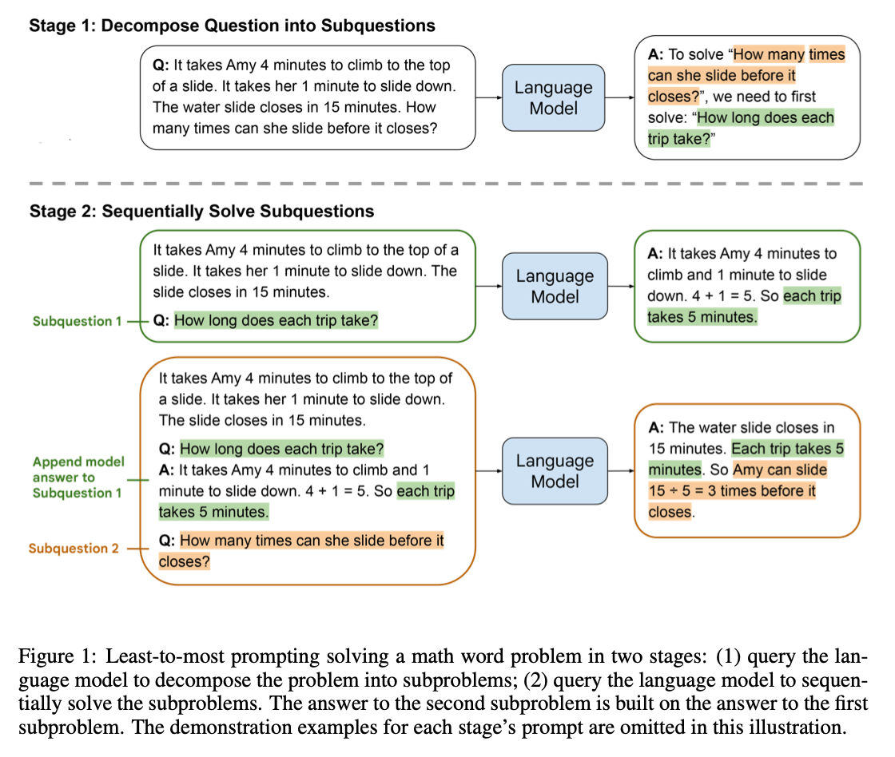
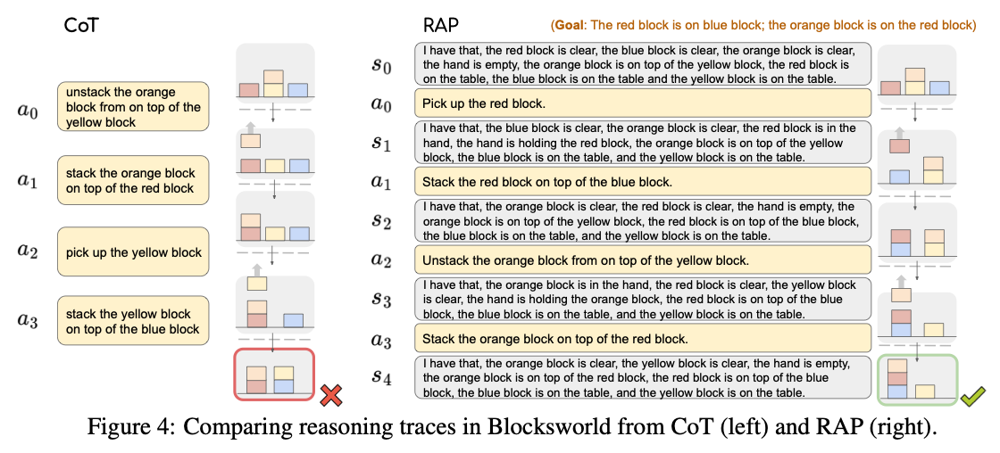
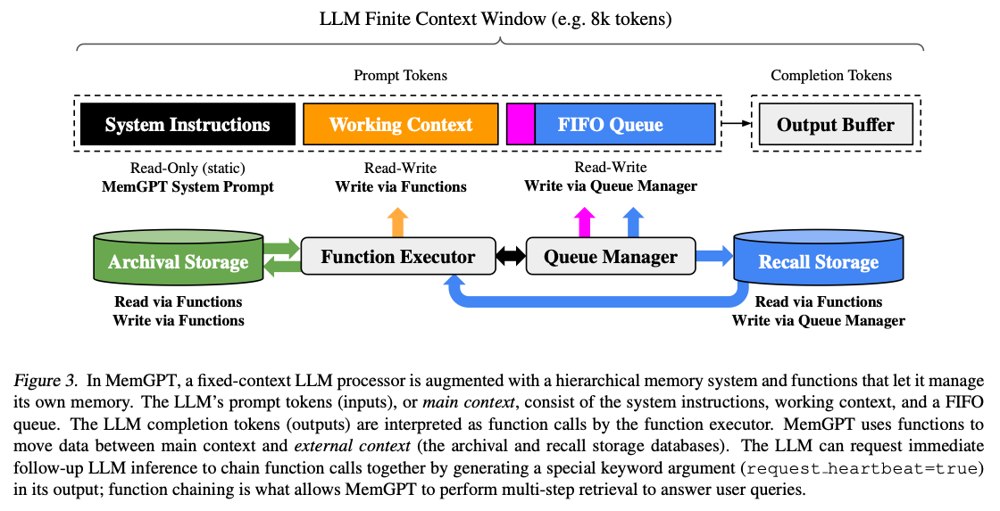
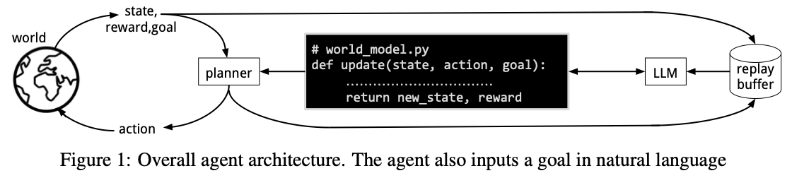
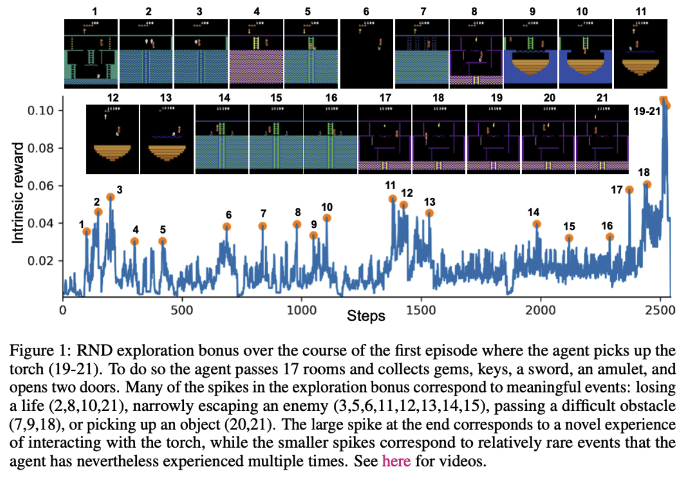

# Core Components of Intelligent Agents

This document builds upon the survey paper ***"Advances and Challenges in Foundation Agents From Brain-Inspired Intelligence to Evolutionary, Collaborative, and Safe Systems", Liu et al. (2025) [<a href="https://arxiv.org/abs/2504.01990" target="_blank">paper</a>]***, organizing related research works according to **the core components of agents**.

**LLMs** are confined to passive text processing—reading tokens and generating responses within a closed system that forgets context once the conversation ends.

**Agents**, by contrast, actively perceive environments through multimodal sensors, maintain persistent memory, execute real-world actions via tools, and autonomously pursue long-term goals through continuous learning and adaptation. 

An intelligent agent is composed of several **core components**, which we will explore in detail in the following sections.

<!--------------->
<!--------------->

## 1. Cognition

### 1.1. Learning

>Learning is the process by which an agent improves its performance over time through experience.

"Voyager: An Open-Ended Embodied Agent with Large Language Models", Wang et al. (2023) [<a href="https://arxiv.org/abs/2305.16291" target="_blank">paper</a>]

 

**Voyager** is **a lifelong learning agent** in Minecraft that learns autonomously without fine-tuning. It generates its own tasks (**automatic curriculum**), stores successful behaviors as reusable code skills (**skill library**), and **iteratively improves its code** through feedback loops, enabling continual learning in an embodied environment.

<!--------------->

"Reflexion: Language Agents with Verbal Reinforcement Learning", Shinn et al. (2023) [<a href="https://arxiv.org/abs/2303.11366" target="_blank">paper</a>]

 

**Reflexion** is a framework that enables **language agents to learn from their mistakes through verbal self-reflection** rather than traditional weight updates. The agent iteratively improves its performance by **storing natural language feedback about its failures in episodic memory** and using these reflections to inform future attempts.

<!--------------->

"Search-R1: Training LLMs to Reason and Leverage Search Engines with Reinforcement Learning", Jin et al. (2025) [<a href="https://arxiv.org/abs/2503.09516" target="_blank">paper</a>]

 

**Search-R1** is an extension of **reinforcement learning (RL)** for reasoning frameworks where the LLM **learns to interact with search engines** autonomously, generating multiple search queries during step-by-step reasoning. 

 

<!--------------->
<!--------------->

### 1.2. Reasoning

>Reasoning is the agent’s internal cognitive process of transforming perception and knowledge into coherent decisions or actions.

"Chain-of-Thought Prompting Elicits Reasoning in Large Language Models", Wei et al. (2023) [<a href="https://arxiv.org/abs/2201.11903" target="_blank">paper</a>]

 

**Chain-of-Thought (CoT)** demonstrates that **generating a series of intermediate reasoning steps** significantly improves the ability of LLMs to perform complex reasoning.

<!--------------->

"Self-Consistency Improves Chain of Thought Reasoning in Language Models", Wang et al. (2023) [<a href="https://arxiv.org/abs/2203.11171" target="_blank">paper</a>]

 

**Self-Consistency** **samples a diverse set of reasoning paths** instead of only taking the greedy one, and then **selects the most consistent answer** by marginalizing out the sampled reasoning paths.

<!--------------->

"Self-Refine: Iterative Refinement with Self-Feedback", Madaan et al. (2023) [<a href="https://arxiv.org/abs/2303.17651" target="_blank">paper</a>]

 

**Self-Refine** is an approach for improving initial outputs from LLMs through **iterative feedback and refinement**.

<!--------------->

"ReAct: Synergizing Reasoning and Acting in Language Models", Yao et al. (2023) [<a href="https://arxiv.org/abs/2210.03629" target="_blank">paper</a>]

 

**ReAct** introduces a framework where **LLMs interleave reasoning traces with actions** (Thought-Action-Observation), enabling them to both think and act interactively.

<!--------------->

"Tree of Thoughts: Deliberate Problem Solving with Large Language Models", Yao et al. (2023) [<a href="https://arxiv.org/abs/2305.10601" target="_blank">paper</a>]

 

While previous works, such as Chain of Thought (CoT), generate continuous language sequences for problem-solving with LLMs, **Tree of Thoughts (ToT)** enables **a structured exploration of the thought tree** with lookahead and backtracking using search algorithms like BFS and DFS. 

e.g., **Game of 24** is a mathematical reasoning challenge, where the goal is to use four numbers and basic arithmetic operations (+-*/) to obtain 24. For example, given input “4 9 10 13”, a solution output could be “(10 - 4) * (13 - 9) = 24”.\
In each tree state, ToT **proposes** *k* next steps, then **evaluates** each step, selecting those with the most promising states.

<!--------------->

"Graph of Thoughts: Solving Elaborate Problems with Large Language Models", Besta et al. (2024) [<a href="https://arxiv.org/abs/2308.09687" target="_blank">paper</a>]

 

**Graph of Thoughts (GoT)** models LLM reasoning as **a graph of interconnected thoughts**, enabling **transformations such as aggregation, refinement, and generation**. This graph structure generalizes both Chain-of-Thought (linear chains) and Tree-of-Thoughts (trees) as special cases.

<!--------------->

"Take a Step Back: Evoking Reasoning via Abstraction in Large Language Models", Zheng et al. (2024) [<a href="https://arxiv.org/abs/2310.06117" target="_blank">paper</a>]

 

**Step-Back Prompting** enables LLMs to **abstract** from instances that contain specific details, deriving high-level concepts, then solve the original problem leveraging that abstraction.

<!--------------->

"Training Large Language Models to Reason in a Continuous Latent Space", Hao et al. (2024) [<a href="https://arxiv.org/abs/2412.06769" target="_blank">paper</a>]

 

**Chain of Continuous Thought (Coconut)** utilizes **the last hidden state** of the LLM as **a latent representation of the reasoning state** and **feeds it back to the LLM** as the subsequent input embedding.

<!--------------->
<!--------------->

### 1.3. Planning

>Unlike direct reasoning, planning involves generating hypothetical action sequences before execution, functioning as computational nodes that remain inactive until deployed.

"Least-to-Most Prompting Enables Complex Reasoning in Large Language Models", Zhou et al. (2023) [<a href="https://arxiv.org/abs/2205.10625" target="_blank">paper</a>]

 

**Least-to-Most prompting** break down a complex problem into **a series of simpler subproblems and then solve them in sequence**. Solving each subproblem is facilitated by the answers to previously solved subproblems.

<!--------------->

"Describe, Explain, Plan and Select: Interactive Planning with Large Language Models Enables Open-World Multi-Task Agents", Wang et al. (2024) [<a href="https://arxiv.org/abs/2302.01560" target="_blank">paper</a>]

 

**Describe, Explain, Plan and Select (DEPS)** facilitates better error correction on the initial LLM-generated plan by integrating **description of the plan execution process** and providing ** self-explanation of feedback when encountering failures** during the extended planning phases. Furthermore, it includes **a goal selector, a trainable module that ranks parallel candidate sub-goals**, thereby refining the initial plan.

<!--------------->

"HuggingGPT: Solving AI Tasks with ChatGPT and its Friends in Hugging Face", Shen et al. (2023) [<a href="https://arxiv.org/abs/2303.17580" target="_blank">paper</a>]

 

**HuggingGPT** uses ChatGPT to **conduct task planning** when receiving a user request, select models according to their function descriptions available in Hugging Face, **execute each subtask with the selected AI model**, and summarize the response according to the execution results.

<!--------------->

"ProgPrompt: Generating Situated Robot Task Plans using Large Language Models", Singh et al. (2022) [<a href="https://arxiv.org/abs/2209.11302" target="_blank">paper</a>]

 

**ProgPrompt** prompts the LLM with program-like specifications of the available actions and objects in an environment, as well as with example programs, to generate ** an executable plan** for the robot tasks.

<!--------------->

"Language Agent Tree Search Unifies Reasoning Acting and Planning in Language Models", Zhou et al. (2024) [<a href="https://arxiv.org/abs/2310.04406" target="_blank">paper</a>]

 

**Language Agent Tree Search (LATS)** expands ReAct (Yao et al., 2023) by incorporating **Monte Carlo Tree Search (MCTS)** to explore a space of reasoning and acting steps under external environmental feedback.

<!--------------->

"Reasoning with Language Model is Planning with World Model", Hao et al. (2023) [<a href="https://arxiv.org/abs/2305.14992" target="_blank">paper</a>]

 

**Reasoning via Planning (RAP)** repurposes **the LLM as both a world model and a reasoning agent**, and incorporates a planning algorithm based on Monte Carlo Tree Search. During reasoning, **the LLM (as agent) incrementally builds a reasoning tree** under **the guidance of the LLM (as world model) and rewards**, and efficiently obtains a high-reward reasoning path with a proper balance between exploration vs. exploitation. 

<!--------------->

"LLM+P: Empowering Large Language Models with Optimal Planning Proficiency", Liu et al. (2023) [<a href="https://arxiv.org/abs/2304.11477" target="_blank">paper</a>]

 

**LLM+P** **converts the natural language description into the planning domain definition language (PDDL)**, then leverages **classical planners to find an optimal plan**, and then translates the plan back into natural language.

<!--------------->
<!--------------->

## 2. Memory

>Memory enables an agent to maintain context, integrate past experience, and act coherently over time.

"Generative Agents: Interactive Simulacra of Human Behavior", Park et al. (2023) [<a href="https://arxiv.org/abs/2304.03442" target="_blank">paper</a>]

 

This paper proposes **Generative agents** with an architecture that **manages constantly growing memories**, allowing the agents to **remember, retrieve, reflect, and plan** based on their experience.

<!--------------->

"MemGPT: Towards LLMs as Operating Systems", Packer et al. (2024) [<a href="https://arxiv.org/abs/2310.08560" target="_blank">paper</a>]

 

**MemGPT (MemoryGPT)** is an OS-inspired multi-level memory architecture that distinguishes between two types of memory: **main context** (similar to main memory), which consists of the LLM prompt tokens, and **external context** (similar to disk storage), stored outside of the LLM's fixed context window. MemGPT provides function calls for the LLM processor to **manage its own memory without any user intervention**.

The main context includes **(1) system instructions**, which are static instructions; **(2) working context**, which stores key facts, preferences, and other important information about the user and the agent's persona, only modifiable via MemGPT function calls; and **(3) the FIFO queue**, which maintains a rolling history of messages, including communications between the agent and user, system messages, and function call inputs and outputs.

<!--------------->

"Agent S: An Open Agentic Framework that Uses Computers Like a Human", Agashe et al. (2024) [<a href="https://arxiv.org/abs/2410.08164" target="_blank">paper</a>]

 

**Agent S** is an open, agentic framework that enables autonomous interaction with computers through a Graphical User Interface (GUI). The agent stores **detailed, step-by-step subtask experiences in episodic memory** and **high-level, abstract experiences in narrative memory**, and later retrieves relevant memories to complete a task.

<!--------------->

"User Behavior Simulation with Large Language Model based Agents", Wang et al. (2024) [<a href="https://arxiv.org/abs/2306.02552" target="_blank">paper</a>]

 

**RecAgent** models three key parts of human memory: **sensory memory, short-term memory, and long-term memory**. The **sensory memory** directly interacts with the environment, and it summarizes raw observations from the environment into more informative and concise contents. **Short-term memory** serves as an intermediate part connecting sensory memory and long-term memory. If an agent repeatedly encounters similar observations, then the related short-term memories are enhanced and transformed into **long-term memories**.

<!--------------->

"MemoryBank: Enhancing Large Language Models with Long-Term Memory", Zhong et al. (2023) [<a href="https://arxiv.org/abs/2305.10250" target="_blank">paper</a>]

 

**MemoryBank** features ** a memory updating system** inspired by the Ebbinghaus Forgetting Curve theory. This system **allows the AI to forget and reinforce memories based on time elapsed and the importance of the memory**, thereby offering a more human-like memory process.

<!--------------->

"Lyfe Agents: Generative agents for low-cost real-time social interactions", Kaiya et al. (2023) [<a href="https://arxiv.org/abs/2310.02172" target="_blank">paper</a>]

 

**Lyfe Agent** adopts **a summarize-and-forget strategy**: it first clusters related memories, refines them into concise summaries, and then removes older memories that are highly similar to newer ones.

<!--------------->

"ExpeL: LLM Agents Are Experiential Learners", Zhao et al. (2024) [<a href="https://arxiv.org/abs/2308.10144" target="_blank">paper</a>]

 

**Experiential Learning (ExpeL)** agent autonomously gathers experiences and extracts knowledge from a range of training tasks. During inference, the agent **derives solid insights by comparing failed and successful trajectories**, and **generalizing effective practices from multiple successes across tasks**. These insights are dynamically updated through LLM-guided operations (ADD, EDIT, UPVOTE, DOWNVOTE) and are later used to enhance task inference.

<!--------------->

"JARVIS-1: Open-World Multi-task Agents with Memory-Augmented Multimodal Language Models", Wang et al. (2023) [<a href="https://arxiv.org/abs/2311.05997" target="_blank">paper</a>]

 

**JARVIS-1** uses ** a multimodal memory** to store experiences and retrieve them during planning. It **employs the multimodal model CLIP** to measure alignment within a multimodal key-value memory, where the key includes the task and visual observations, and the value is a text-based representation of successfully completed plans.

<!--------------->
<!--------------->

## 3. World Model

>World model enables an agent to predict and reason about future states without direct trial-and-error in reality.

"World Models", Ha and Schmidhuber (2018) [<a href="https://arxiv.org/abs/1803.10122" target="_blank">paper</a>]

 

In the **world models framework**, **a variational autoencoder (VAE)** is first trained to encode high-dimensional visual observations into **a compressed latent space**. Separately, **a recurrent network is trained to model the dynamics in this latent space** by predicting future latent vectors. 

<!--------------->

"DINO-WM: World Models on Pre-trained Visual Features enable Zero-shot Planning", Zhou et al. (2025) [<a href="https://arxiv.org/abs/2411.04983" target="_blank">paper</a>]

 

**DINO-WM** introduces **a world model that learns dynamics in the latent space of pre-trained visual features (from DINOv2)**, trained to predict future patch features using offline behavioral trajectories. This allows DINO-WM to reach visual goals in a zero-shot manner through **action sequence optimization**, without requiring task-specific training or pixel-level reconstruction.

<!--------------->

"DayDreamer: World Models for Physical Robot Learning", Wu et al. (2022) [<a href="https://arxiv.org/abs/2206.14176" target="_blank">paper</a>]

 

**DayDreamer** applies the world-model–based reinforcement learning algorithm Dreamer to **physical robots**, demonstrating that they can **learn diverse tasks directly in the real world without simulators and within a short amount of time**.

<!--------------->

"WorldCoder, a Model-Based LLM Agent: Building World Models by Writing Code and Interacting with the Environment", Tang et al. (2024) [<a href="https://arxiv.org/abs/2402.12275" target="_blank">paper</a>]

 

**WorldCoder** is an architecture where an agent interacts with the environment, **autonomously builds a world model in the form of Python code**, and then plans and acts based on that model.

<!--------------->
<!--------------->

## 4. Reward

>Rewards are externally defined signals that guide an agent’s behavior toward specific goals.

"Training language models to follow instructions with human feedback", Ouyang et al. (2022) [<a href="https://arxiv.org/abs/2203.02155" target="_blank">paper</a>]

 

This paper is the cornerstone of **RLHF (Reinforcement Learning from Human Feedback)**, establishing how dense, human-preference-based rewards can align large language models with user intent.

<!--------------->

"Direct Preference Optimization: Your Language Model is Secretly a Reward Model", Rafailov et al. (2024) [<a href="https://arxiv.org/abs/2305.18290" target="_blank">paper</a>]

 

**Direct preference optimization (DPO)** reparameterizes **the reward as an implicit function of the policy**, enabling **direct optimization from pairwise preferences without reward modeling** or RL instabilities.

<!--------------->

"Curiosity-driven Exploration by Self-supervised Prediction", Pathak et al. (2017) [<a href="https://arxiv.org/abs/1705.05363" target="_blank">paper</a>]

 

This paper introduces **an intrinsic motivation framework** where an agent learns to explore by **predicting the consequences of its own actions** in a learned feature space; **the prediction error itself serves as a curiosity reward**, enabling effective exploration even in environments with sparse or no external rewards.

<!--------------->

"Exploration by Random Network Distillation", Burda et al. (2018) [<a href="https://arxiv.org/abs/1810.12894" target="_blank">paper</a>]

 

**Random Network Distillation (RND)** generates **exploration bonuses by training a predictor network to match the outputs of a fixed random target network**, where prediction error serves as a simple proxy for **state novelty** without requiring any dynamics modeling.

<!--------------->
<!--------------->
