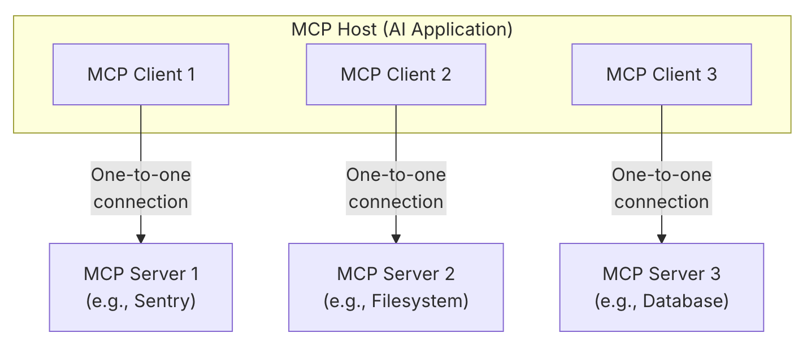
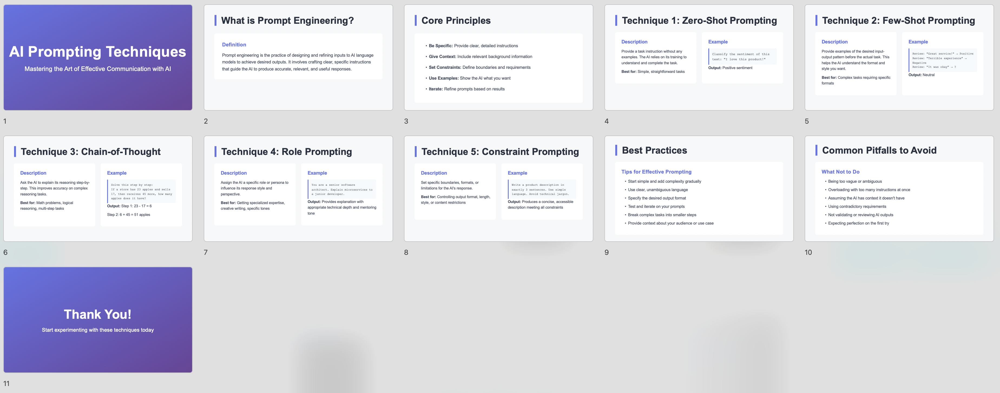
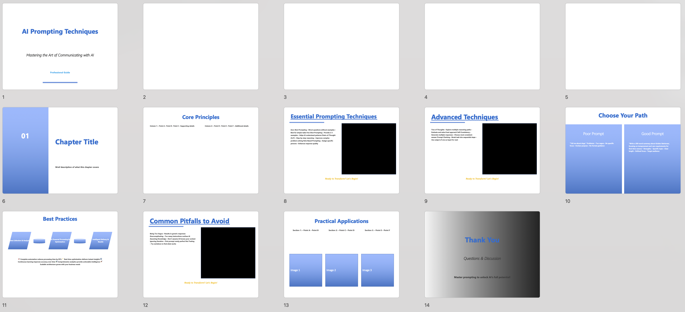

# Skills vs MCP

Skills는 **재사용 가능한 워크플로우 패키징 메커니즘**이고, MCP는 **외부 시스템 통합을 위한 표준 프로토콜**입니다.  

| 구분 | **Skills** | **MCP** |
| - | - | - |
| **목적** | 특정 작업에 대한 지침과 워크플로우 제공 | 외부 데이터 소스 및 도구와의 연결 |
| **벤더** | Claude 전용 | 벤더 독립적 표준 프로토콜 |
| **주요 구성** | 폴더 (`SKILL.md`, Scripts, Resources) | Client-Server (Tools, Resources, Prompts) |
| **적절한 사용 사례** | 반복적이고 표준화된 작업을 Claude를 사용하여 자동화 | 외부 시스템과 연동이 필요한 벤더 독립적 솔루션 구현 |


---

## Table of Contents

[1. Skills](#1-skills)\
[2. MCP (Model Context Protocol)](#2-mcp-model-context-protocol)\
[3. Skills vs MCP](#3-skills-vs-mcp)\
[3.1. Task 1: PPTX](#31-task-1-pptx)\
[3.2. Task 2: Web Search](#32-task-2-web-search)\
[4.Integrated Use of Skills and MCP](#4-integrated-use-of-skills-and-mcp)\
[4.1. Integrated System Architecture](#41-integrated-system-architecture)\
[4.2. Use Cases by Scenario](#42-use-cases-by-scenario)\
[5.Code Execution with MCP](#5-code-execution-with-mcp)\
[5.1. Background](#51-background)\
[5.2. Implementation](#52-implementation)\
[5.3. Experiment](#53-experiment)\
[6. References](#6-references)


---

## 1. Skills

### 1.1. 핵심 개념

* **폴더 기반 패키지**: `SKILL.md` 및 **추가 가이드 문서**, **스크립트(실행 코드)**, **리소스(템플릿, 데이터)** 등을 묶어서 배포합니다.

    ```
    my_skill/
    ├── SKILL.md           # Required: Instructions for Claude
    ├── *.md               # Optional: Any additional guide materials
    ├── scripts/           # Optional: Python/JS code
    │   └── processor.py
    └── resources/         # Optional: Templates, data
        └── template.xlsx
    ```

    * **`SKILL.md`**: 상단의 **YAML frontmatter**(`name`, `description`)와 **Markdown 지침**으로 구성됩니다.

        ```md
        ---
        name: pdf-processing
        description: Extract text and tables from PDF files, fill forms, merge documents. Use when working with PDF files or when the user mentions PDFs, forms, or document extraction.
        ---
        
        # PDF Processing

        ## Quick start

        Use pdfplumber to extract text from PDFs:

        ```python
        import pdfplumber

        with pdfplumber.open("document.pdf") as pdf:
            text = pdf.pages[0].extract_text()
        ```

* **Progressive Disclosure 메커니즘**: 

  모든 사용 가능한 skill의 **YAML frontmatter를 스캔**하여 현재 작업과의 관련성을 평가한 후, **관련된 skill의 자료를 선택적으로 로드**합니다. \
  이는 프롬프트 길이가 과도하게 늘어나는 것을 방지하는 효과가 있습니다.

  1. 각 skill의 `SKILL.md` **YAML frontmatter**만 시스템 프롬프트에 선주입.
  2. 현재 작업과 관련된 skill의 `SKILL.md` **Markdown 지침**을 컨텍스트에 주입.
  3. 추가적인 자료(스크립트, 리소스 등)는 필요할 경우에만 **선택적으로** 접근.

---

### 1.2. API 사용

API에서 Skills를 사용할 때는 skill 리스트를 포함하는 `container`를 지정합니다. \
각 skill은 `type`, `skill_id`, `version`을 가지며, 코드 실행이 필요한 경우가 대다수이므로 code execution tool을 함께 활성화합니다.

```python
import anthropic

client = anthropic.Anthropic()

response = client.beta.messages.create(
    model="claude-sonnet-4-5-20250929",
    max_tokens=4096,
    betas=["code-execution-2025-08-25", "skills-2025-10-02"],
    # Skills 지정
    container={
        "skills": [
            {
                "type": "anthropic", # or "custom"
                "skill_id": "pptx",
                "version": "latest"
            }
        ]
    },
    messages=[{
        "role": "user",
        "content": "Create a presentation about renewable energy"
    }],
    # Code execution tool 활성화
    tools=[{
        "type": "code_execution_20250825",
        "name": "code_execution"
    }]
)

```

---

### 1.3. 사용 가능 Skills

공식에서 배포된 Anthropic Skills를 사용하거나, 직접 커스텀하여 사용하는 두 가지 방법이 있습니다. 

| 구분 | **Anthropic Skills** | **Custom Skills** |
| - | - | - |
| **Type 값** | `anthropic` | `custom` |
| **Skill ID 형식** | 짧은 이름 (e.g., `pptx`, `xlsx`, `docx`, `pdf`) | 자동 생성 (e.g., `skill_01AbCdEfGhIjKlMnOpQrStUv`) |
| **Version 형식** | 날짜 기반 (e.g., `20251013` or `latest`) | epoch 기반 (e.g., `1759178010641129` or `latest`) |
| **Management** | Anthropic이 사전 구축 및 유지 보수 | 사용자가 [Skills API](https://docs.claude.com/en/api/skills/create-skill)로 업로드 및 관리 |
| **Availability** | 모든 사용자에게 제공 | 워크스페이스 전용 (비공개) |

#### Anthropic Skills
* [GitHub 리포지토리](https://github.com/anthropics/skills)
* 사용 가능한 skill 예시:
  * `pptx` (PowerPoint)
  * `xlsx` (Excel)
  * `docx` (Word)
  * `pdf`  (PDF 처리)

#### Custom Skills
* [GitHub 리포지토리](https://github.com/anthropics/claude-cookbooks/tree/main/skills) (예제 및 쿡북) 
* 생성 방법
  * **필수**: `SKILL.md` 상단에 **YAML frontmatter**(`name`, `description`), 본문에 **지침**(워크플로우, 규칙, 예시 등)을 작성합니다.
  * **선택**: 동일한 폴더에 스크립트 파일, 템플릿 등을 작성합니다.

---

## 2. MCP (Model Context Protocol)

* **오픈 프로토콜**: MCP는 LLM 애플리케이션과 외부 시스템을 연결하는 표준화된 방식을 제공합니다.

* **아키텍처**: MCP는 **클라이언트-서버 구조**를 따릅니다. 하나의 MCP 호스트는 클라이언트를 통해 여러 MCP 서버와 연결할 수 있습니다.
  * **MCP 호스트**: 여러 MCP 클라이언트를 관리하고 조정하는 AI 애플리케이션.
  * **MCP 클라이언트**: MCP 서버와의 연결을 유지하며, 서버로부터 컨텍스트 정보를 수집하는 구성 요소.
  * **MCP 서버**: MCP 클라이언트에 컨텍스트를 제공하는 프로그램.

  

* **핵심 Primitive**: MCP 서버는 다음과 같은 **세 가지 주요 기능**을 제공합니다.
  * **Tools**: LLM이 직접 호출할 수 있는 실행 가능한 함수.
  * **Resources**: AI 애플리케이션에 맥락 정보를 제공하는 데이터 소스.
  * **Prompts**: 반복적으로 재사용 가능한 프롬프트 템플릿.

* **전송 방식**: MCP는 두 가지 통신 방식을 지원합니다.
  * **Stdio Transport**: 동일한 머신 내의 프로세스 간에 표준 입출력 스트림(stdio)을 사용하여 직접 통신.
  * **Streamable HTTP Transport**: HTTP POST를 사용하여 클라이언트에서 서버로 메시지를 전송하고, Server-Sent Events를 통해 스트리밍 기능을 제공.


---

## 3. Skills vs MCP

동일한 태스크에 대해 **Claude Skills**와 **MCP (Model Context Protocol)** 의 작동 방식 및 성능을 비교한 결과입니다.  

### 3.1. Task 1: PPTX

실험 코드와 상세 결과물은 [`experiment1`](./experiment1) 디렉토리에서 확인할 수 있습니다.

#### 실험 세팅

* **공통 설정**
  * 사용 모델: `claude-sonnet-4-5-20250929`
  * 사용자 프롬프트: *"Create a PowerPoint presentation about AI prompting techniques."*
  * Temperature: 0.5
  * 반복 횟수: 10회 시도 후 평균값 계산

* **Skills**
    * `{"type": "anthropic", "skill_id": "pptx", "version": "20251013"}`

* **MCP**
  * [Office-PowerPoint-MCP-Server](https://github.com/GongRzhe/Office-PowerPoint-MCP-Server)

#### 실험 결과

* **정량 평가**

  | Metric | Skills | MCP |
  | - | - | - |
  | **Duration (sec)** | 432.34 | 101.91 |
  | **Input Tokens** | 1,471,175 | 218,070 |
  | **Output Tokens** | 16,592 | 5,561 |
  | **Tool Calls** | 49 | 28 |
  | **Success Ratio** | 40% | 100% |

  * **Skills**는 Progressive Disclosure 전략을 사용하여 context 사이즈를 줄이려 시도했으나,  
    보다 세밀한 작업이 이루어지면서 MCP에 비해 **duration(처리 시간), input/output token 수, tool call 횟수가 크게 증가**함.  
  * 실제 결과물(.pptx) 저장 여부를 기준으로 판단한 **success ratio**의 경우, **MCP**는 100% 로 안정적이었던 반면 **Skills**는 **max token limit** 문제 등으로 작업이 중단되는 경우가 있어 40% 수준에 머무름.

* **정성 평가**
  * **Skills**는 비교적 일관된 슬라이드 구조와 디자인 품질을 유지하며, 시각적으로 완성도가 높은 결과물을 생성함 ([실험 결과물 예시](experiment1/skills/test_pptx)).

    

  * **MCP**는 일부 슬라이드에서 빈 페이지, 작은 글씨, 비일관적 레이아웃 등 시각적 완성도가 다소 낮은 경향을 보임 ([실험 결과물 예시](experiment1/mcp/test_pptx)).

    

---

### 3.2. Task 2: Web Search

이 실험은 **복잡한 다중 제약 조건 문제**를 웹 검색을 통해 해결하는 능력을 비교합니다.  
BrowseComp 벤치마크를 사용하여 Skills와 MCP 구현의 성능을 평가했습니다.

실험 코드와 상세 결과물은 [`experiment2`](./experiment2) 디렉토리에서 확인할 수 있습니다.

#### 실험 세팅

**공통 설정**
* **벤치마크**: [BrowseComp](https://openai.com/index/browsecomp/)
    * 웹 검색을 통해서만 해결 가능한 복잡한 추론 문제
    * 10개 샘플 랜덤 추출하여 평가
* **검색 엔진**: [DuckDuckGo](https://serpapi.com/duckduckgo-search-api) (무료), [Brave](https://brave.com/search/api/), [Serper](https://serper.dev/) (유료, Free Credit 가능)
* **사용 모델**: `claude-sonnet-4-5-20250929`
* **Temperature**: 1.0
* **Claude API Call 제한**: 35회/문제
* **채점 모델**: `claude-haiku-4-5-20251001`

**구현 방식**

| 구분 | **Skills** | **MCP** |
| - | - | - |
| **구현체**   | [`strategic-search`](experiment2/claude_agent/extensions/skills/strategic-search) | [`search-mcp-server`](experiment2/claude_agent/extensions/mcp/search-mcp-server) |
| **검색 방식** | Skills가 `search-mcp-server`를 통해 웹 접근                                                                     | MCP 서버가 직접 검색 API 호출                                                                                    |
| **핵심 전략** | `SKILL.md`에 상세한 문제 해결 워크플로우 정의                                                                           | MCP tools를 통한 직접적인 검색 실행                                                                                |

#### Skills 구현 상세

Skills 방식에서는 `SKILL.md`를 통해 **체계적인 문제 해결 전략**을 제공합니다:

* **핵심 워크플로우** ([`SKILL.md`](experiment2/claude_agent/extensions/skills/strategic-search/SKILL.md) 참고)

  1. **제약 조건 추출 및 랭킹**
      
      * 문제의 모든 제약 조건을 명시적으로 추출
      * 가장 특징적인 조건부터 우선순위 부여
      * 예: "ascetics backstory" (매우 독특) > "fewer than 50 episodes" (검증 가능) > "comedic" (일반적)
      
  2. **점진적 검색 및 검증**
      
      * 가장 특징적인 조건으로 초기 검색 수행
      * 정답 후보를 발견하면 나머지 제약 조건을 순차적으로 검증
      * 제약 조건을 만족하지 못하면 즉시 해당 후보 제외

* **검색 예산 관리**

  * 모든 제약 조건을 만족하는 답을 찾으면 **즉시 종료**
  * Search 20: 80% 이상 만족하면 종료
  * Search 25: 최선의 답변으로 마무리
  * Search 30: 절대 한도

* **엔진 선택 전략**

  * **DuckDuckGo (무료)**: 기본 검색 엔진
  * **Brave / Serper (유료)**: DuckDuckGo 결과가 불충분하거나 교차 검증이 필요한 경우에만 선택적 사용

#### Skills 구현의 기술적 제약과 해결책

* **발견된 제약 사항**

  Skill 폴더에 Python 스크립트를 포함할 수 있으나, 해당 스크립트는 Anthropic 내부 환경(`"type": "server_tool_use"`)에서 실행되며 다음과 같은 제약이 있습니다:

  * ***패키지 설치 불가**: `pip install` 등 외부 패키지 설치 불가
  * **인터넷 접근 제한**: HTTPS 연결 불가
  * **용량 제한**: 8MB 제한으로 의존성 라이브러리 포함 어려움
      
      ```
      Error: 'Request exceeds the maximum size. The Skills API accepts requests up to 8MBs.'
      ```
    

* **해결 방법: Hybrid 아키텍처**

  직접 웹 검색 스크립트를 실행하는 대신, **MCP 서버를 통해 검색을 수행**하되 **Skills의 전략적 워크플로우로 제어**하는 하이브리드 방식을 채택했습니다:

  ```
  Skills (전략 & 워크플로우) 
      ↓ 
  MCP Server (실제 웹 검색 실행)
      ↓
  Skills (검색 결과를 기반으로 워크플로우 재개)
  ```

  | 역할 | **Skills** | **MCP** |
  | - | - | - |
  | **핵심 기능**  | 전략 & 워크플로우 제어                                                                         | 실제 검색 실행                                           |
  | **구체적 역할** | - 문제 분석 및 제약 조건 추출<br>- 검색 전략 수립 및 순서 결정<br>- 검색 예산 관리 (카운트 추적)<br>- 후보 검증 및 조기 종료 판단 | - Skills의 지시에 따라 실제 웹 검색 수행<br>- 검색 결과를 Skills에 전달 |

#### 실험 결과

* **정량 평가**

  | Metric             | Skills  | MCP     |
  | ------------------ | ------- | ------- |
  | **Accuracy**       | 10%     | 10%     |
  | **Duration (sec)** | 393.55  | 316.31  |
  | **Input Tokens**   | 879,452 | 538,636 |
  | **Output Tokens**  | 5,157   | 4,063   |
  | **Tool Calls**     | 33.0    | 32.7    |

  * **정확도**: 두 접근법 모두 10%의 동일한 정확도를 기록했습니다.
  * **효율성**: MCP가 처리시간, 토큰 사용량 등 리소스 사용 측면에서 더 효율적입니다.
  * **Tool Call 패턴**: 평균 tool call 횟수는 거의 동일하였습니다.

* **정성 평가**

  * **Skills** ([실험 결과물 예시](results/skills/20251107_162310))
    * 명시적 워크플로우를 따르려는 시도가 관찰됨
    * 그러나 컨텍스트 길이가 증가하며 일관성 유지 어려움
    * 검색 카운트 추적은 비교적 잘 수행
  * **MCP** ([실험 결과물 예시](results/mcp/20251107_162407))
      * 더 직접적이고 간결한 검색 패턴
      * 워크플로우 가이드라인 없이도 유사한 성능 달성
      * 리소스 효율성이 높음

* **한계 및 함의**

  현재 실험 결과만으로는 Skills의 워크플로우 접근법이 검색 기반 추론 문제에서 명확한 이점을 제공하지 못했습니다. 정확도는 동일하면서 리소스 사용량만 증가했기 때문입니다.

  다만 본 실험은 **제한된 샘플 크기**(10개)와 **초기 단계의 Skills 구현**이라는 한계를 가지고 있습니다. 따라서 실험의 결과는 Skills 개념 자체의 한계를 보여주기 보다는, BrowseComp와 같은 고난도 벤치마크에서 효과적인 검색 전략을 정의하는 것이 까다로울 수 있음을 보여줍니다.

---

#### 주요 인사이트

**Skills와 MCP의 관계: 대체가 아닌 상호 보완**

* 현재 Skills에 부여된 기술적 제약(패키지 설치 불가, 인터넷 접근 제한, 용량 제한)으로 인해 Skills가 MCP를 완전히 대체하기는 어렵습니다. 
* 또한 Anthropic이 제시한 커스텀 Skills 예시를 살펴보면, Skills의 설계 의도는 **반복적이고 정형화된 작업의 워크플로우를 패키징하여 재사용 가능하게 만드는 것**에 가깝습니다.
	* [Image Editor Skill](https://youtu.be/kS1MJFZWMq4): 사진 회전, 크롭 등 반복적이고 정형화된 태스크를 자동화
* 즉 Skills은 MCP의 대안보다는, **상위 레이어의 추상화**로 보는 것이 더 적절해 보입니다. 이 둘은 서로 다른 강점을 가지고 있으며, 함께 사용할 때 시너지를 발휘할 수 있습니다 (Skills - 문제 해결 전략 제시, MCP - 외부 시스템과의 연결).


---

## 4. Integrated Use of Skills and MCP

Skills와 MCP는 서로 다른 강점을 가지고 있으며, 이 둘을 함께 활용하면 더 강력한 AI 에이전트 시스템을 구축할 수 있습니다.\
이 목차는 MCP를 통해 문제를 해결하는 과정에서 발견된 워크플로우를 자동으로 Skills로 패키징하는 시스템을 제시합니다.

### 4.1. Integrated System Architecture

#### 핵심 아이디어

MCP 서버를 통해 문제를 해결한 후, 에이전트가 해결 과정(trajectory)을 분석합니다. 재사용 가능한 워크플로우 패턴을 발견하면 자동으로 Custom Skill을 생성하고, 생성된 스킬은 향후 유사한 문제 해결 시 참고 자료로 활용됩니다.

#### 주요 기능

1. **자동 Skill 생성**: trajectory를 분석하여 정형화할 만한 워크플로우를 발견하면 [`skill-creator`](https://github.com/anthropics/skills/tree/main/skill-creator) 스킬을 사용해 자동으로 스킬 생성
2. **기존 Skill 개선**: 생성된 스킬 활용 과정에서 개선점 발견 시 새로운 버전의 스킬 생성
3. **Skill 통합**: 여러 trajectory를 종합 분석(aggregate)하여 더욱 일반화된 스킬 생성

#### 구현체

* 디렉토리: [`extended_agent`](./extended_agent)
* 사용된 MCP 서버: `search`, [`fetch`](https://github.com/modelcontextprotocol/servers/tree/main/src/fetch), [`desktop-commander`](https://github.com/wonderwhy-er/DesktopCommanderMCP/)

---

### 4.2. Use Cases by Scenario

#### 시나리오 1: MCP 기반 문제 해결 → Skill 생성

**문제 정의**

```
TypeScript 최신 트렌드를 검색하고, 결과를 요약해서 
typescript_trends.txt 파일로 저장해줘.
```

**해결 과정**

1. `search` MCP 서버로 TypeScript 트렌드 검색
2. `fetch` MCP 서버로 상세 정보 수집
3. 정보 종합 및 요약
4. `desktop-commander` MCP 서버를 사용하여 파일 로컬에 저장

**워크플로우 패턴 분석**

에이전트가 해결 과정을 분석한 결과, 다음과 같은 워크플로우 패턴을 발견했습니다:

```
1. 웹에서 특정 주제 정보 검색
2. 관련 출처에서 상세 내용 수집
3. 발견 사항 요약 및 종합
4. 지정된 파일 위치에 요약본 저장
```

이 패턴은 다음 기준을 충족하여 Skill 생성이 적합하다고 판단되었습니다:

* **복잡성**: 4단계의 명확한 구조
* **도구 통합**: 웹 검색, fetch, 파일 시스템 작업
* **재사용성**: 다양한 시나리오에 적용 가능

**생성된 Skill: `web-research-documenter`**

---

#### 시나리오 2: 기존 Skill 활용 → 개선된 버전 생성

**문제 정의**

```
React 생태계의 최신 트렌드를 종합 분석해줘:

1) 주요 라이브러리 업데이트 조사
   - React Router, Redux, Zustand, TanStack Query, Jotai
   - 각 라이브러리의 최신 버전과 주요 변경사항 검색

2) GitHub 통계 수집 및 분석
   - 각 라이브러리의 GitHub API 호출하여 데이터 수집
   - Stars, Forks, Open Issues, Last Update 추출
   - 성장률 계산 (최근 3개월 star 증가량)

3) 종합 비교 분석
   - 라이브러리별 점수 계산 (GitHub stars 등 기반)
   - 가중 평균으로 종합 순위 산정
   - 추천 라이브러리 선정 (상위 3개)

4) 결과 저장
   - 모든 분석 결과를 react_ecosystem_analysis.md에 저장
   - 원본 데이터는 react_data.json에 저장
```

**해결 과정**

1. `search` MCP 서버로 React 생태계 라이브러리 정보 검색
2. `fetch` MCP 서버로 각 라이브러리의 상세 정보 수집
3. `desktop-commander` MCP 서버로 GitHub API 호출 스크립트 실행
4. 수집된 데이터를 기반으로 정량적 분석 수행 (점수 계산, 순위 산정)
5. 분석 결과를 Markdown과 JSON 형식으로 이중 저장

**워크플로우 패턴 분석**

에이전트는 기존 `web-research-documenter` 스킬을 활용하여 문제를 해결했으나, 다음과 같은 추가 요구사항을 발견했습니다:

```
- Github API를 통한 데이터 수집
- 계산 알고리즘 적용 (점수, 순위, 성장률)
- 데이터 구조화 및 비교 분석
- 실행 가능한 스크립트 생성
- 이중 출력 형식 (원본 데이터 + 분석 리포트)
```

이 패턴은 기존 스킬과 확연한 차별점을 가지며, 오픈소스 생태계 비교 분석에 일반적으로 활용 가능하므로 새로운 Skill 을 생성합니다.

**생성된 Skill: `tech-ecosystem-analyzer`**

---

#### 시나리오 3: 여러 Trajectory 통합 → 새로운 Skill 생성

**문제 정의**

**문제 1: AI/ML 컨퍼런스 정보 수집**
```
2025년 동안 예정된 주요 AI/ML 컨퍼런스를 검색하고, 
개최 날짜, 개최 장소, 주요 세션(트랙·키노트 포함), 
공식 등록 링크를 시간순으로 정리해서 
ai_conferences_2025.md로 저장해줘.
```

**문제 2: 스마트폰 출시 정보 수집**
```
2025년 1분기 주요 스마트폰 출시 정보를 검색하고, 
모델명, 출시일, 주요 스펙을 출시일 순으로 정리해서 
phone_launches_q1_2025.txt로 저장해줘.
```

**해결 과정**

**문제 1 (AI/ML 컨퍼런스)**
1. `search` MCP 서버로 2025년 AI/ML 컨퍼런스 정보 검색
2. 각 컨퍼런스별 상세 정보(날짜, 장소, 세션) 추가 검색
3. `fetch` MCP 서버로 공식 웹사이트 접근 및 정보 수집
4. 개최 날짜 기준 시간순 정리
5. `desktop-commander` MCP 서버로 Markdown 형식으로 저장

**문제 2 (스마트폰 출시)**
1. `search` MCP 서버로 2025년 Q1 스마트폰 출시 정보 검색
2. 각 모델별 상세 스펙 정보 추가 검색
3. 제조사 공식 페이지 접근 시도
4. 출시일 기준 시간순 정리
5. `desktop-commander` MCP 서버로 텍스트 형식으로 저장

**워크플로우 패턴 분석**

에이전트는 두 문제 해결 과정에서 다음과 같은 공통 패턴을 발견했습니다:

```
1. 특정 시간 범위의 이벤트/제품 정보 검색
2. 각 항목별 세부 정보 추가 수집
3. 공식 출처 접근 및 검증 (가능한 경우)
4. 시간순 구조화 및 일관된 형식 정리
5. 지정된 위치에 문서화하여 저장
```

이 공통적인 패턴은 다음 기준을 충족하여 Skill 생성이 적합하다고 판단되었습니다:

* **복잡성**: 5단계의 체계적인 프로세스
* **도구 통합**: 웹 검색, fetch, 파일 시스템 작업
* **재사용성**: 다양한 도메인의 "출시/이벤트" 조사에 적용 가능

**생성된 Skill: `release-tracker`**

---

## 5. Code Execution with MCP

최근 Anthropic에서 발표한 ["Code Execution with MCP"](https://www.anthropic.com/engineering/code-execution-with-mcp) 아티클은 MCP 사용 시 발생하는 컨텍스트 윈도우 문제를 해결하는 새로운 접근법을 제시합니다.

이 접근법은 엄밀히 말하면 Skills와 직접적인 관련은 없지만, **Skills의 핵심 장점인 Progressive Disclosure를 MCP 환경에서도 구현할 수 있는 방법론**이라는 점에서 함께 다룰 가치가 있습니다.

### 5.1. Background

#### 문제: MCP 스케일링에 따른 Context 오버헤드

MCP가 AI 에이전트를 외부 시스템에 연결하는 업계 표준으로 자리잡으면서, 수천 개의 MCP 서버가 생성되었습니다. 한편 에이전트에 연결되는 MCP 서버와 도구의 수가 늘어남에 따라 심각한 스케일링 문제가 발생했습니다.

대부분의 MCP 클라이언트는 **모든 도구 정의를 시작 시점에 시스템 프롬프트에 로드**합니다. 각 도구 정의는 다음과 같은 형태를 가집니다:

```
mcp-server-fetch.fetch 
Description: Fetches a URL from the internet and extracts its contents as markdown 
Parameters:
	- url (required, string): URL to fetch
	- max_length (optional, integer): Maximum number of characters to return (default: 5000)
	- start_index (optional, integer): Starting character index for output (default: 0)
	- raw (optional, boolean): Get actual HTML without simplification (default: false) Returns: Fetched content as markdown or raw HTML

desktop-commander.write_file 
Description: Writes or appends content to a file 
Parameters:
	- path (required, string): Absolute file path
	- content (required, string): Content to write (recommended: 25-30 lines per chunk)
	- mode (optional, string): Write mode - "rewrite" or "append" (default: "rewrite") 
Returns: Confirmation of successful write operation
```

한두 개의 도구만 연결할 경우에는 큰 문제가 없지만, **수십, 수백 개의 도구를 연결하면 상당한 양의 토큰이 컨텍스트 윈도우를 차지**하게 됩니다. 여러 도구 사용이 필요한 복잡한 에이전트 워크플로우에서는 이러한 input token 증가로 인해 **처리 비용이 크게 상승하고**, **컨텍스트 limit에 빠르게 도달**하는 문제가 발생합니다.

#### 해법: Code Execution with MCP

Anthropic이 제안한 해법은 MCP 도구를 에이전트에 직접 노출하는 대신, **각 도구를 코드로 wrapping하여 파일시스템에 배치**하고, 에이전트가 **필요한 도구만 선택적으로 로드**하여 사용하도록 하는 것입니다.

이를 통해 약 **150,000 토큰을 소비하던 워크플로우가 약 2,000 토큰으로 감소**하여 **98.7%의 토큰 사용량 절감**을 달성했다는 성과 또한 보고되었습니다.

---

### 5.2. Implementation

위에서 소개한 Anthropic의 Code Execution with MCP 접근법을 Python 환경에서 구현했습니다.

**구현체 위치**: [`extended_agent`](./extended_agent)

#### MCP 도구 Wrapping

``` 
extensions/wrapped_mcp/ 
├── mcp_server_fetch/ # fetch MCP 서버
│   ├── fetch.py  # fetch 도구를 wrapping한 Python 함수 
│   └── __init__.py 
└── desktop_commander/ # desktop-commander MCP 서버
	├── write_file.py 
	├── read_file.py 
	├── ...
```

각 MCP 서버의 도구를 Python 함수로 wrapping하여 서버별 폴더 구조로 저장합니다. 에이전트는 이 파일시스템을 탐색하며 필요한 도구만 선택적으로 로드할 수 있습니다.

#### Progressive Discovery

에이전트에게 MCP 도구를 직접 제공하는 대신, **로컬에서 실행 가능한 Python 코드를 생성**하도록 지시합니다. 생성된 코드는 외부 실행 환경에서 실행되며, 그 결과가 에이전트에게 피드백됩니다.

**단계별 프로세스:**

1. **서버 목록 확인**
   
   ```python
   import os
   print(os.listdir("extensions/wrapped_mcp/"))
    ```

2. **필요한 서버의 도구 목록 확인**
    
    ```python
    import os
    print(os.listdir("extensions/wrapped_mcp/mcp_server_fetch"))
    ```
    
3. **필요한 도구 문서 읽기**
    
    ```python
    with open("extensions/wrapped_mcp/mcp_server_fetch/fetch.py") as f:
        print(f.read())
    ```
    
4. **도구 사용**
    
    ```python
    import asyncio
    from extensions.wrapped_mcp.mcp_server_fetch import fetch
    
    async def main():
        result = await fetch({"url": "https://example.com"})
        print(result)
    
    asyncio.run(main())
    ```

---
	
### 5.3. Experiment

MCP를 직접 사용하는 일반적인 방식(**Direct MCP**)과 Code Execution을 통해 사용하는 방식(**Code Execution with MCP**)의 성능을 비교합니다.

#### 실험 세팅

* **평가 방법**: 5개의 태스크 프롬프트 사용
* **사용 MCP 서버**: `search`, `fetch`, `desktop-commander`

#### 측정 결과

| Metric                   | Direct MCP | Code Execution with MCP | 변화율        |
| ------------------------ | ---------- | ----------------------- | ---------- |
| **Duration (sec)**       | 111.3      | 90.3                    | -18.9%     |
| **System Prompt Tokens** | 12,319     | 741                     | **-94.0%** |
| **Input Tokens**         | 216,835    | 54,776                  | **-74.7%** |
| **Output Tokens**        | 4,414      | 2,750                   | -37.7%     |
| **API Call Count**       | 10.0       | 11.4                    | +14.0%     |

#### 주요 발견

**1. System Prompt 크기의 극적인 감소**

System prompt 토큰 수가 **12,319개에서 741개로 94% 감소**했습니다. 이는 모든 MCP 도구 정의를 미리 로드하는 대신, Progressive Disclosure 방식으로 필요한 도구만 선택적으로 로드했기 때문입니다.

**2. 전체 Input/Output 토큰 감소**

* Input 토큰: 74.7% 감소
* Output 토큰: 37.7% 감소

Code Execution 방식에서는 에이전트가 **여러 작업을 단일 스크립트로 통합**하는 경향을 보임에 따라, Input 토큰뿐만 아니라 Output 토큰 수도 감소했습니다.

* **Direct MCP**: `search` → 결과 분석 및 요약 → `write_file` (여러 단계로 분리)
* **Code Execution**: `search`와 `write_file`을 하나의 스크립트에서 처리

**3. API 호출 횟수는 소폭 증가**

Code Execution 방식에서 API 호출이 14% 증가(10.0 → 11.4)했습니다. 이는 Progressive Disclosure를 위해 파일시스템을 단계적으로 탐색해야 하기 때문입니다:

```
1. 사용 가능한 서버 목록 확인
2. 특정 서버의 도구 목록 확인
3. 필요한 도구의 문서 읽기
4. 도구 사용
```

**4. 처리 시간 감소**

API 호출 횟수가 증가했음에도 전체 처리 시간은 18.9% 감소했습니다. 이는 각 호출에서 처리하는 토큰 수가 크게 줄어들어 응답 속도가 빨라졌기 때문일 수 있습니다.

#### 개선 가능성

Code Execution 방식에서 에이전트가 여러 작업을 자동으로 통합하는 경향은 때로는 작업을 지나치게 단순화할 수 있습니다.\
Skills를 활용해 **명시적인 워크플로우**를 따르도록 유도하면 작업의 질과 효율성을 동시에 확보할 수 있을 것으로 보입니다.

#### 종합 평가

실험 결과는 Code Execution with MCP 접근법의 효과를 명확히 보여줍니다:
* **System prompt 크기 94% 감소**로 컨텍스트 효율성 극대화
* **전체 토큰 사용량 대폭 감소**로 비용 절감 및 처리 속도 향상
* **API 호출 횟수의 소폭 증가**는 Progressive Disclosure의 합리적인 트레이드오프

#### 한계 및 고려사항

 코드 실행 방식은 안전한 샌드박스 환경 구축 등 추가적인 인프라 요구사항을 가져오며, 이는 운영 오버헤드와 보안 고려사항을 증가시킬 수 있습니다.

---

## 6. References

* https://www.anthropic.com/news/skills
* https://docs.claude.com/en/docs/agents-and-tools/agent-skills
* https://docs.claude.com/en/api/skills-guide
* https://github.com/anthropics/skills
* https://github.com/anthropics/claude-cookbooks/tree/main/skills
* https://modelcontextprotocol.io/docs
* https://www.youtube.com/watch?v=kS1MJFZWMq4
* https://serpapi.com/duckduckgo-search-api
* https://serper.dev/
* https://brave.com/search/api/
* https://openai.com/index/browsecomp/
* https://www.anthropic.com/engineering/code-execution-with-mcp
* https://github.com/anthropics/skills/tree/main/skill-creator
* https://github.com/wonderwhy-er/DesktopCommanderMCP/
* https://github.com/modelcontextprotocol/servers/tree/HEAD/src/fetch
